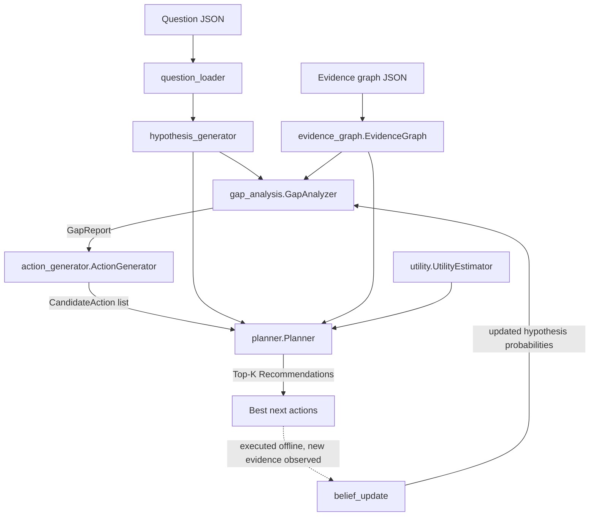
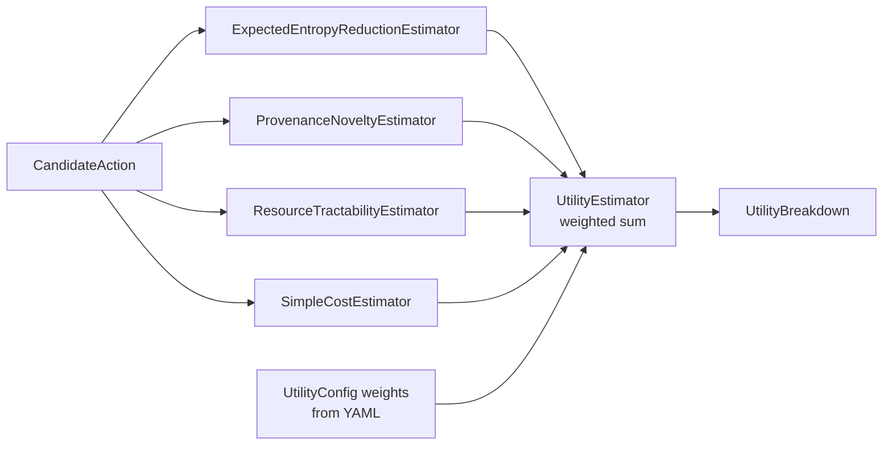
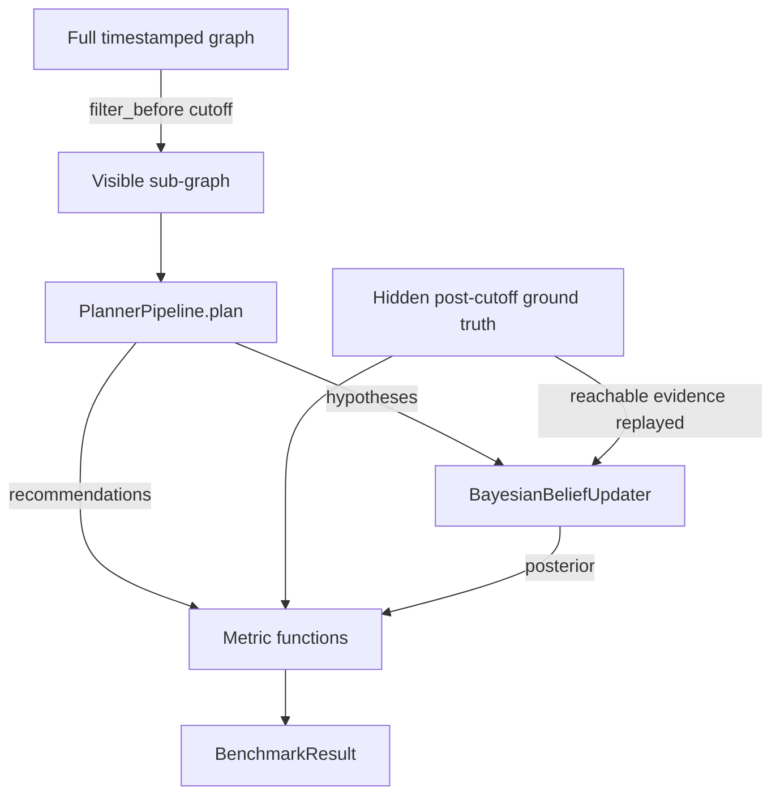

# Architecture

The framework is a pipeline of independent modules that communicate only
through shared dataclasses (`schemas.py`) and the `EvidenceGraph` interface.
No module imports another module's internals; composition happens at the
edge (e.g. `experiments/run_benchmark.py`) via dependency injection.

## Module diagram

The dashed edge closes the loop: after evidence is (externally) acquired, the
belief updater revises hypothesis probabilities and the cycle repeats. The
framework itself never executes actions.

## Utility estimator composition

Each component implements the same `ComponentEstimator` protocol
(`estimate(action, hypotheses, graph) -> float`) and is injected into
`UtilityEstimator`, so any component can be replaced independently.

## Evaluation harness

`PlannerPipeline` is a protocol: the benchmark drives any concrete wiring of
the modules without depending on one.

## Coupling rules

- `schemas.py` has no imports from other modules; everything imports it.
- `evidence_graph.py` depends only on schemas.
- `gap_analysis`, `action_generator`, `utility`, `planner`, `belief_update`
  depend on schemas (+ the graph interface where needed) — never on each other.
- `evaluation.py` depends on the belief-update and utility *interfaces* plus
  schemas; concrete pipelines are supplied by the caller.
